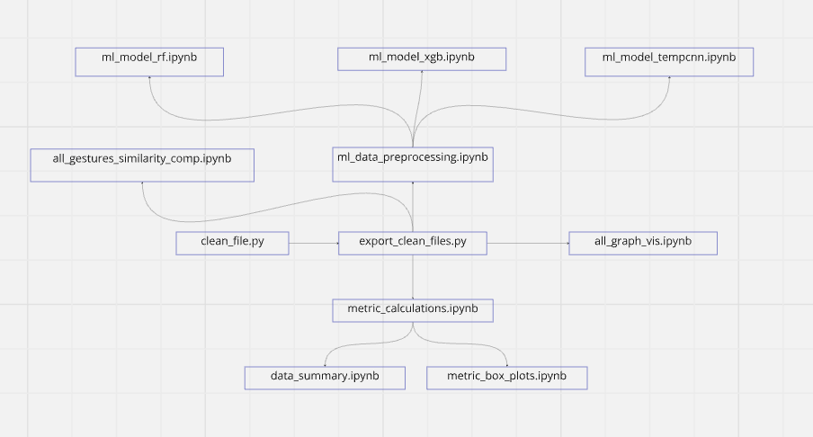

# Gesture Interface

## Table of Contents
1) Project Overview
2) Libraries
3) File Descriptions & Dependencies
4) Directory Structure

## Libraries to install
- matplotlib
- numpy
- os
- pandas
- plotly
- scipy
- sklearn
- tensorflow

## File Descriptions & Dependencies

### `clean_file.py`

**Purpose**: Contains functions to help clean data files more efficiently and organized. It takes in a data file and removes trials that have been striked (when the x button is pressed and the x_counter increases).

- **Dependencies**: N/A

- **Connections**: 
  - Called by `export_clean_files.py` to get preprocessed data.

### `export_clean_files.py`

**Purpose**: Cleans data files by removing trials that have been striked and exports the new csv files to a specified CleanedData folder.

- **Dependencies**:
    - Requires a data directory as input.

- **Connections**: 
  - Not call on by any script but other scripts will require files outputted by this.
    - all_graph_vis.ipynb
    - metric_calculations.ipynb

### `all_graph_vis.ipynb`

**Purpose**: Visualizes participants' hand motion data. It outputs two different html files. The first is an individual figure of all of the trials in a single participant session. The second groups all of the individual single participant sessions for a single gesture on one file to view all simultaneously.

- **Dependencies**:
    - Requires a data directory as input. Data directory must be outputted from export_clean_files.py.
    - Requires a folder called "Figures" to output html visualizations to.

- **Connections**: 
    - Uses output files generated from export_clean_files.py as input.

### `metric_calculations.ipynb

**Purpose**: Performs metric calculations for specified features of the participants' gesture data. It then outputs the measurement value calculated for each of the first five trials per hand and exports it as csv file. For each gesture, there will be two files for freeform and instructional. 

- **Methodology**:
    - Remove accidental strokes based on strokes_to_remove csv files.
    - Run code six times for each of the metric calculations and edit variables accordingly.
    - Length
        - Use a sliding window of size 2 to calculate the distance between each pair and sum up all the lengths.
    - Duration
        - The time at which the trigger was released subtracted by the time at which the trigger was pulled.
    - Speed
        - Length / Duration: Uses the output files from the length and duration calculations.
    - Acceleration
        - Speed / Duration: Uses the output files from the speed and duration calculations.
    - Angle
        - Smooth the curve of the stroke using B-spline.
        - Determine 10 points on the curve.
        - Measure the external angle between two vectors made from every overlapping set of three consecutive points on the curve (dot product of two normalized vectors and the converted from radians to degrees).
        - Identify outliers with median absolute deviation and remove them from the list of curvature.
        - Calculate the average with the remaining values.
    - Curvature
        - Smooth the curve of the stroke using B-spline.
        - Determine 10 points on the curve.
        - Measure the curvature between every overlapping set of three consecutive points on the curve.
            - Find the triangle area created by the three data points 
                - Cross product of vectors 'ab' and 'bc' and calculate the norm from the result
                - Multiply it by .5
            - Use the menger curvature formula to calculate the curvature
                - (4 * area) / (ab * bc * ac)
                    - ab, bc, ac represents the length of each side on the triangle
        - Identify outliers with median absolute deviation and remove them from the list of curvature
        - Calculate the average with the remaining values.

- **Dependencies**:
    - Requires stroke removal csv file, which contains a list of strokes that were created on accident for each participant session.
    - Requires a data directory as input. Data directory must be outputted from export_clean_files.py
    - Requires a folder called "MetricCalculations" and subfolders for each of the metrics in there to output files to.

- **Connections**: 
    - Uses output files generated from export_clean_files.py as input.

### `metric_box_plots.py`

**Purpose**: Creates box plots based on the metric calculations data files.

- **Dependencies**:
    - Requires a data directory as input. Data directory must be outputted from export_clean_files.py.
    - Requires a subfolder in Figures called "BoxPlots" to output html visualizations to.

- **Connections**: 
    - Uses output files generated from metric_calculations.ipynb as input.

### `data_summary.py`

**Purpose**: Summarizes the metric calculations of each gesture session such as max, min, mean, etc.

- **Dependencies**:
    - Requires a data directory as input. Data directory must be outputted from metric_calculations.ipynb.
    - Requires a subfolder in MetricCalculations called "MetricSummary" to output summary files for each gesture to.

- **Connections**: 
    - Uses output files generated from metric_calculations.ipynb as input.

### `cb_info_extract.py`

**Purpose**: Analyzes codebook for all gestures and outputs a summary csv. Determines the percentage of participant sessions that create a certain shape for each hand, uses unimanual/bimanual, same/diff direction, and symmetry/asymmetry.

- **Dependencies**:
    - Requires a data directory as input. Data directory must be a folder called "Codebook" and contain codebook csvs for each gesture.

- **Connections**: 
    - N/A

### `avg_gesture_similarity_comp.ipynb`

**Purpose**: Generates average stroke template for each hand controller per gesture.

- **Dependencies**:
    - Uses output files from the "CleanedData" directory
    - Requires stroke removal csv file, which contains a list of strokes that were created on accident for each participant session.

- **Connections**: 
    - "CleanedData" directory comes from export_clean_files.py

### `ml_data_preprocessing.ipynb`
**Purpose**: Preprocesses the participants' data to be used as training/testing data in various ml models. Different models will have various preprocessing steps, though they do share a few common ones.

- **Dependencies**:
    - Uses output files from the "CleanedData" directory
    - Requires stroke removal csv file, which contains a list of strokes that were created on accident for each participant session.
    - For the label count file, labels will need to be manually inputted prior to calling the codeblocks for it.

- **Connections**: 
    - "CleanedData" directory comes from export_clean_files.py

### `ml_model_rf.ipynb`
**Purpose**: Builds an random forest model

- **Dependencies**:
    - Uses preprocessed data files from ml_data_preprocessing.ipynb. There should be 7 statistics files outputted to a SummaryStatistics folder. This includes AccelerationStats.csv, AngleStats.csv, CurvatureStats.csv, DurationStats.csv, LengthStats.csv, SpeedStats.csv, and VelocityStats.csv.

- **Connections**: 
    - "CleanedData" directory comes from export_clean_files.py

### `ml_model_xgb.ipynb`
**Purpose**: Builds an xg boost model

- **Dependencies**:
    - Uses preprocessed data files from ml_data_preprocessing.ipynb. There should be 7 statistics files outputted to a SummaryStatistics folder. This includes AccelerationStats.csv, AngleStats.csv, CurvatureStats.csv, DurationStats.csv, LengthStats.csv, SpeedStats.csv, and VelocityStats.csv.

- **Connections**: 
    - "CleanedData" directory comes from export_clean_files.py

### `ml_model_tcn.ipynb`
**Purpose**: Builds an temporal convolutional neural network model

- **Dependencies**:
    - Uses preprocessed data file from ml_data_preprocessing.ipynb. It should be outputted to a NormalizedEgocentricData folder and called normalized_resampled_entire_data.csv or normalized_resampled_sw_data.csv based on which method the model should be trained on.

- **Connections**: 
    - "CleanedData" directory comes from export_clean_files.py

### `vr_data_processing_rf_xgb.ipynb`

**Purpose**: Real time model prediction in VR. Takes raw data directly from the Unity VR project and preprocesses for the rf or xgb model predictions. Preprocessing includes removing hooks, egocentralizing, extracting features/summary statistics, and finally prediction.

- **Dependencies**:
    - N/A

- **Connections**: 
    - Used by Unity VR project

### `vr_data_processing_tcn.ipynb`

**Purpose**: UNFINISHED. Real time model prediction in VR. Takes raw data directly from the Unity VR project and preprocesses for the tcn model predictions. Preprocessing includes removing hooks, egocentralizing, resampling 128 points, normalization, and finally prediction.

- **Dependencies**:
    - N/A

- **Connections**: 
    - Used by Unity VR project

## Directory Structure

**AvgStrokeTemplates**

**CleanedData**
- Sub01
    - Freeform_Sub01_Sess1
        - cleaned_session_F_BoxSelect...
- Sub02

**Codebook**
- Codebook_Pan_Down.csv
- Codebook...

**Data**

- Sub01
    - Freeform_Sub01_Sess1
        - session_F_BoxSelect...
    - Freeform_Sub01_Sess2
    - Instructional_Sub01_Sess1
    - Instructional_Sub01_Sess2

**DataAnalysis**
- all_graph_vis.ipynb
- avg_gesture_similarity_comp.ipynb
- box_select_all_participants.ipynb
- cb_info_extract.ipynb
- clean_file.py
- color_vis.ipynb
- data_summary.py
- egocentric_coord.ipynb
- export_clean_files.py
- metric_box_plots.py
- metric_calculations.ipynb
- min_max_test.ipynb
- ml_data_preprocessing.ipynb
- ml_model_tempcnn.ipynb
- ml_model_rf.ipynb
- ml_models_xgboost.ipynb
- plot_preprocessed_data.ipynb
- vr_data_processing_rf_xgb.py
- vr_data_processing_tcn.py

**Figures**
- BoxSelect
    - Freeform
        - Box_Select_Freeform_Sub1_Sess1.html
    - Instructional
- PanDown
- ...

**MachineLearning**
- HookRemovedData
    - PanDown.csv
    - PanLeft.csv
- HookRemovedEgocentralizedData
    - PanDown.csv
    - PanLeft.csv
- NormalizedEgocentricData
    - normalized_resampled_entire_data.csv
    - normalized_resampled_sw_data.csv
- RawData
    - PanDown.csv
    - PanLeft.csv
- SummaryStatistics
    - AccelerationStats.csv
    - AngleStats.csv
    - CurvatureStats.csv
    - DurationStats.csv
    - LengthStats.csv
    - SpeedStats.csv
    - VelocityStats.csv
- Models
    - rf_model_entire_data.pkl
    - rf_model_sw_data.pkl
    - xgb_model_entire_data.pkl
- label_count.csv
- stroke_shapes_to_remove.csv
    - GestureAcceleration
        - acceleration_for_pan_down_freeform.csv
        - acceleration_for_pan_down_instructional.csv
    - GestureAngle
    - ...
    - MetricSummary
        - acceleration_freeform_summary.csv
        - acceleration_instructional_summary.csv

**MetricCalculations**
- GestureAcceleration
    - acceleration_for_pan_down_freeform.csv
    - acceleration_for_pan_down_instructional.csv
- GestureAngle
- Gesture...
